# Hi, I'm Mark Joseph Jornales 👋

**Senior Software Engineer** · Philippines, Metro Manila

*I build exceptional digital experiences that are fast, accessible, visually appealing, and responsive.*

**Crafting digital experiences since 2017**

---

## About Me

Dedicated and highly skilled programmer with a passion for solving complex problems through innovative coding solutions. I develop scalable and efficient applications across **web**, **mobile**, **backend**, and **DevOps automation** for reliable deployments, with strong knowledge in **application security** and **system vulnerability assessment**.

I'm a senior software engineer with **9+ years of experience** creating web applications that are both beautiful and functional. My passion lies in bridging the gap between design and development — building solutions that work flawlessly and deliver exceptional user experiences.

With experience across **e-commerce**, **fintech**, and **healthcare**, I bring a diverse perspective to every project and stay ahead of industry trends.

> *"I believe the best digital products are those that seamlessly blend form and function."*

---

## GitHub Stats

<!-- SVG cards in ./assets/ — refreshed by .github/workflows/update-readme-stats.yml -->

  
  

  

  

### Language Proficiency

*Based on years of hands-on experience across the languages in my portfolio.*

| Language | Experience | Proficiency |
| :--- | :---: | :--- |
| **HTML5** | 6 years | `███████████████░░░░░` **19%** |
| **CSS** (Tailwind / SCSS / Bootstrap) | 5 years | `████████████░░░░░░░░` **16%** |
| **JavaScript / TypeScript** | 5 years | `████████████░░░░░░░░` **16%** |
| **SQL** (MySQL / MSSQL) | 4 years | `██████████░░░░░░░░░░` **13%** |
| **Node.js** | 3 years | `███████░░░░░░░░░░░░░` **9%** |
| **Mobile** (Flutter / React Native / Swift / Kotlin) | 3 years | `███████░░░░░░░░░░░░░` **9%** |
| **PHP** (Laravel / CodeIgniter) | 2 years | `█████░░░░░░░░░░░░░░░` **6%** |
| **Python** | 2 years | `█████░░░░░░░░░░░░░░░` **6%** |
| **Solidity / Web3** | 2 years | `█████░░░░░░░░░░░░░░░` **6%** |

### Languages on GitHub

*Live breakdown from public repositories (auto-updated via workflow).*

| Language | Share |
| :--- | :---: |
| Blade | **33.50%** |
| PHP | **26.23%** |
| JavaScript | **23.20%** |
| TypeScript | **11.86%** |
| CSS | **4.77%** |
| Dockerfile | **0.22%** |
| HTML | **0.22%** |

---

## Tech Stack

  

<table>
<tr>
<td valign="top" width="50%">

### Frontend
`React JS` · `Angular JS` · `Vue JS` · `Tailwind` · `Redux` · `Svelte` · `Next JS` · `TypeScript` · `HTML5` · `SCSS / Bootstrap`

### Mobile
`Flutter` · `React Native` · `Kotlin` · `Xamarin` · `Swift`

### Backend
`Python` · `PHP` · `Laravel` · `CodeIgniter` · `Nest JS` · `Node.js` · `Firebase` · `Solidity` · `Web3` · `Smart Contracts`

</td>
<td valign="top" width="50%">

### DevOps & Cloud
`CI/CD Pipelines` · `Docker` · `GitHub Actions` · `GitLab CI` · `Jenkins` · `AWS` · `Digital Ocean` · `Linux` · `Bash Scripting`

### Security
`Application Security` · `Vulnerability Assessment` · `Secure API Design` · `OWASP Best Practices` · `KYC Integration` · `Payment Security`

### Tools
`Git` · `GitLab` · `GitHub` · `Jest` · `Figma` · `MySQL` · `MSSQL Server`

</td>
</tr>
</table>

---

## Technical Experience

| Skill | Experience |
| :--- | :--- |
| JavaScript / TypeScript | 5 years |
| React JS / Redux.js | 4 years |
| HTML5 | 6 years |
| CSS (Bootstrap / Tailwind / SCSS) | 5 years |
| PHP (Laravel / CodeIgniter) | 2 years |
| Mobile Apps (React Native / Flutter / Native) | 3 years |
| Database Management (MySQL / MSSQL Server) | 4 years |
| Version Control (GitLab / GitHub) | 9 years |
| Node.js with RESTful API | 3 years |
| Firebase Integration | 2 years |
| Cloud Deployment (Digital Ocean / AWS) | 4 years |
| DevOps & Automated Deployments (CI/CD, Docker) | 4 years |
| Application Security & Vulnerability Assessment | 4 years |
| Blockchain & Web3 Development | 2 years |
| Linux & Microsoft Server Administration | 4 years |

---

## Work Experience

### Senior Software Engineer · Aurum Platform
`2024 — 2026` · *2 years 6 months*

Gold-backed digital asset platform bridging traditional bullion banking with blockchain technology.

- Built Web3 features: smart contracts, wallet connectivity, on-chain token swaps
- Shipped token trading, gold inventory tracking, and account management (React + Node.js)
- Integrated third-party KYC and secure payment flows
- Developed native iOS (Swift) and Android (Kotlin) apps
- Deployed and managed AWS production infrastructure

**Highlights:** Launched QMGT ↔ USDT trading interface · Blockchain gold-token settlement · KYC + AWS CI/CD pipelines

---

### Mobile Developer · German IT Solution
`Oct 2022 — Feb 2024` · *1 year 5 months*

- Designed mobile app architecture and built cross-platform apps (React Native, Flutter)
- Managed Google Play Store deployments and secured API / payment integrations

---

### Full Stack Web Developer · Soleria Inc.
`Apr 2021 — Jun 2021` · *2 months*

- Maintained PHP + Dojo.js applications; delivered a Ticketing System and asset management fixes

---

### Technical Support / IT Support · Cloudlink System Inc.
`2017 — 2020` · *3 years*

- Database administration (MySQL → MSSQL migration), client support, and internal tooling
- Debugged Java/C# systems; deployed ASP.NET Windows Server workloads

---

## Featured Projects

| Project | Type | Stack |
| :--- | :---: | :--- |
| **[Aurum Platform (Trading)](https://github.com/mjosephjornales1)** | Web | React JS · Node JS · AWS · Solidity · Web3 · KYC |
| **[Aurum Platform (Mobile)](https://github.com/mjosephjornales1)** | Mobile | Swift · Kotlin · Web3 · Blockchain |
| **[Crypto P2P](https://github.com/mjosephjornales1)** | Web | React JS · Tailwind · Node JS |
| **[Servicio App](https://github.com/mjosephjornales1)** | Web | Laravel · Python |
| **[Servicio Mobile](https://github.com/mjosephjornales1)** | Mobile | Flutter |

<strong>Project descriptions</strong>

 

**Aurum Platform (Trading)** — Swap Quantum Metal Gold Tokens (QMGT) for USDT on-chain with transparency, stability, and liquidity.

**Aurum Platform (Mobile)** — Gold-backed digital asset platform merging bullion reliability with blockchain efficiency.

**Crypto P2P** — Fast, secure peer-to-peer crypto transactions platform for the Philippines.

**Servicio App / Mobile** — On-demand marketplace connecting users with trusted service professionals.

---

## Education

| Level | School | Period |
| :--- | :--- | :--- |
| **Tertiary** | Bestlink College of the Philippines — BS Information Technology (Programming) | 2013 — 2017 |
| **Secondary** | Cielito Zamora High School II | 2009 — 2013 |
| **Primary** | Sekulah De Jesus Elementary School | 2002 — 2008 |

---

## Get In Touch

I'm currently **available for freelance work or full-time positions**. Feel free to reach out!

| | |
| :--- | :--- |
| 📧 **Email** | [mjoseph.jornales1@gmail.com](mailto:mjoseph.jornales1@gmail.com) · [markjornales@gmail.com](mailto:markjornales@gmail.com) |
| 📱 **Phone** | [+63 912 214 5221](tel:+639122145221) · [+63 916 626 9399](tel:+639166269399) |
| 📍 **Location** | Philippines, Metro Manila, North Caloocan |
| 🐙 **GitHub** | [github.com/mjosephjornales1](https://github.com/mjosephjornales1) |

---

GitHub stats powered by <a href="https://github.com/anuraghazra/github-readme-stats">github-readme-stats</a> · Skills icons by <a href="https://skillicons.dev">skillicons.dev</a>

